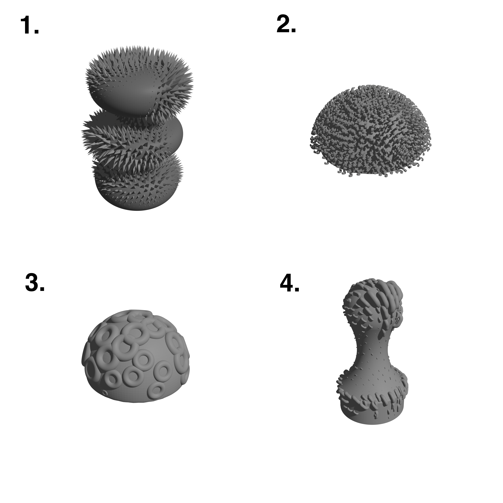
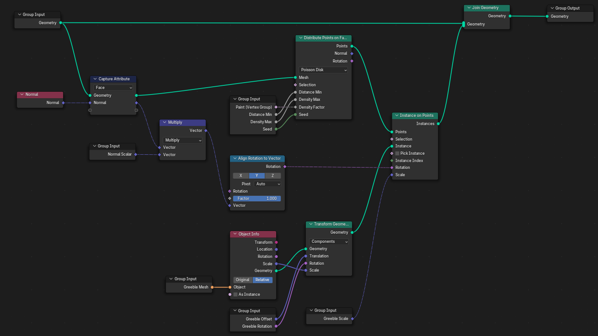

+++
title = "Greebling"
description = "A texturing tool for Blender, embodied in a capacitive pressure sensing MIDI interface."
date = '2026-06-19T09:00:00+02:00'
draft = false
categories = ["academic"]
tags = ["M12 - Research Project"]
subtitle = "Digital Kitbashing for 3D-Printed Sensing Surfaces"
icon = "fa-solid fa-cubes"
stack = ["Blender", "Fusion 360", "RP2040", "C", "MIDI", "Capacitive sensing", "Foaming TPU"]
featured = false
+++

## Abstract

Greebling reimagines 3D-printed textures as a material interface for human computer interaction. Building
on Capricate, HapticPrint, and X-Hair, this work contributes the following: a software tool that enables
creation of 3D surface textures for 3D printing. Through the use of flexible filaments and conductive
filaments, this work proposes a method to enable soft surface textures to sense touch, proximity and
pressure. Through an evaluation with creative users, insights are gained into design learning with opensource
software tools, their explorative capabilities, usability, printability, and possible applications areas.
To demonstrate these textured sensing materials, a live responsive musical interface was built with them.

<!-- Stub page — no source material yet. Add a description, process detail, and photos here.
     Drop image files directly in this folder (content/projects/greebling/) and reference them by
     filename, e.g. . Set draft = false above once it's ready to publish. -->
