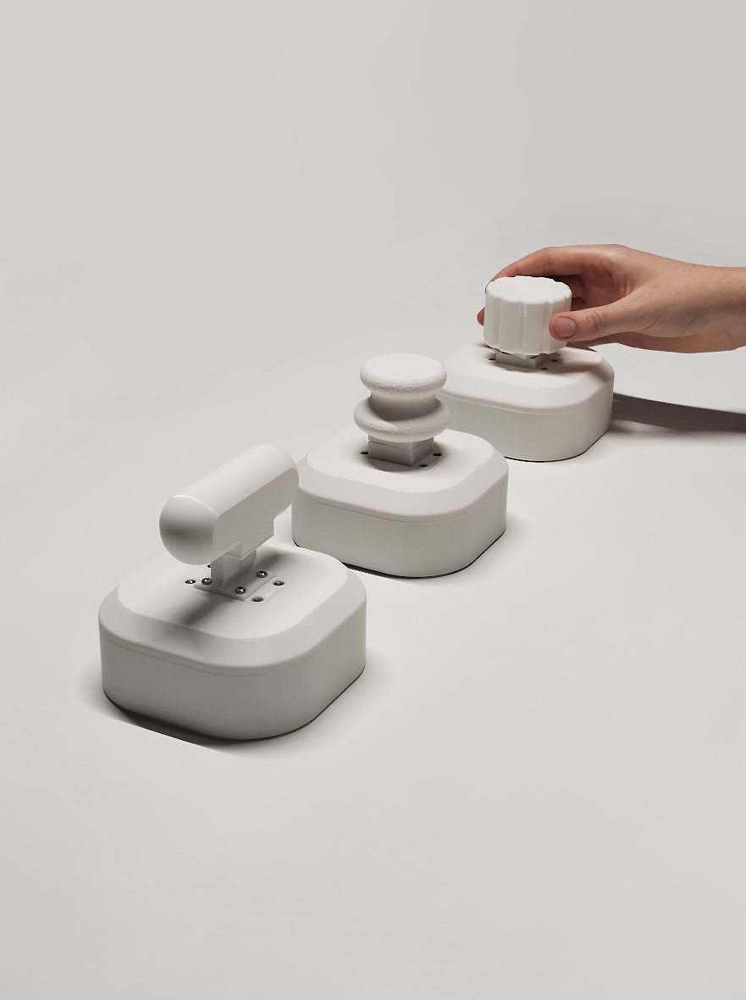
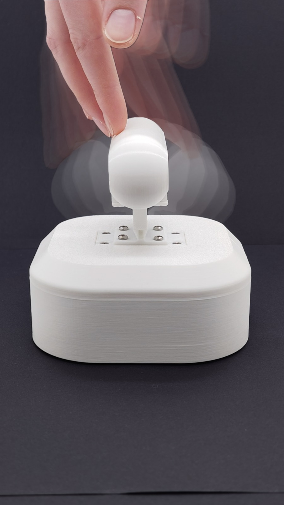
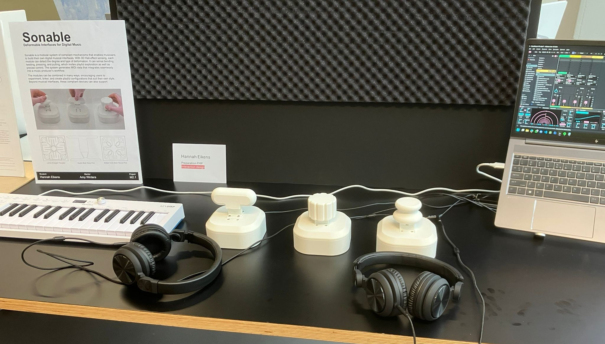

+++
title = "Sonable"
description = "Preparation for FMP, exploring and realizing 3D Hall-effect sensing for MIDI interfaces."
date = '2026-06-19T09:00:00+02:00'
draft = false
categories = ["academic"]
tags = ["M21 FMP Preparation"]
subtitle = "Deformable interfaces for digital music making"
icon = "fa-solid fa-magnet"
stack = ["Raspberry Pi Pico 2", "MLX90395", "Fusion 360", "Arduino", "C++", "PlatformIO", "TPU"]
featured = false
+++

## Abstract

This project introduces a modular system of compliant mechanisms that enable users to build their own digital musical interfaces. 
Through 3D hall-effect sensing, each module can detect how much it is deformed in three dimensions. Possible deformation types include but are
not limited to, bending, twisting, pressing, and pulling. The target user group is electronic musicians. Deformation data is sent through
USB MIDI, allowing free parameter mapping in DAWs and other music software, offering flexibility in Sonable’s use. The modules can
be combined in various ways, not only granting freedom of movement, but also in tailoring the device to the user’s needs.
Beyond musical interfaces, these compliant devices can also support applications such as video game controllers, automobile interfaces,
and tangible interaction, where expressive and playful engagement is central.

<!-- Stub page — no source material yet. Add a description, process detail, and photos here.
     Drop image files directly in this folder (content/projects/sonable/) and reference them by
     filename, e.g. . Set draft = false above once it's ready to publish. -->
