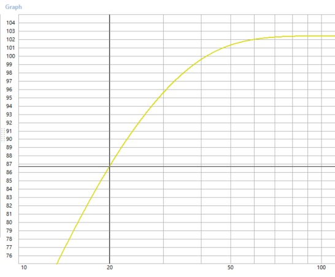

+++
title = "Studio Subwoofer"
description = "A DSP subwoofer for studio use. Designed around a simulated model to achieve a specific frequency response."
date = '2026-06-19T09:00:00+02:00'
draft = false
categories = ["extracurricular"]
tags = ["Extracurricular"]
subtitle = "250 Watt DSP enabled"
icon = "fa-solid fa-volume-high"
stack = ["WinISD", "Fusion 360", "Extracurricular"]
featured = false
+++

## Photos

<!-- Stub page — no source material yet. Add a description, process detail, and photos here.
     Drop image files directly in this folder (content/projects/studio-subwoofer/) and reference
     them by filename, e.g. . Set draft = false above once ready. -->
